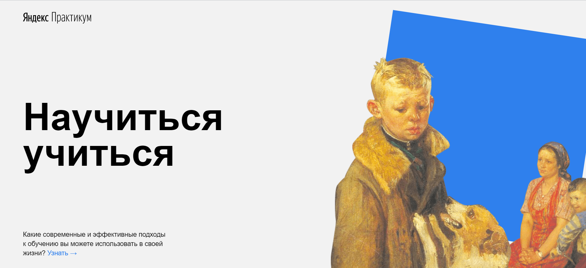

# Привет!

Меня зовут Лиза, а проект, который я сверстала в качестве итоговой работы первого и второго спринта, зовется "Научиться учиться". 

------

Проект собрал в себе слайды с информацией, которая может пригодиться как для организации обучения (техники и методы), так и для вдохновения и мотивации (история Барбары Оакли) или же развлечения (ссылки на шикарные научно-популярные и публицистические ресурсы, видео с ТЕД-выступлениями).

Верстая работу, я задействовала известные мне правила разметки и свойств html и css, использовала css flexbox для оформления плитки, свойств transform и animation + кифреймы для создания дополнительных эффектов, а также постаралась учесть замечания, которые я получила во время работы с проектом в первом спринте - не создавать лишних оберток, использовать заголовки различных уровней, иметь ввиду различные группы пользователей при построении структуры страницы. Структурировать файлы попыталась согласно БЭМ nested.